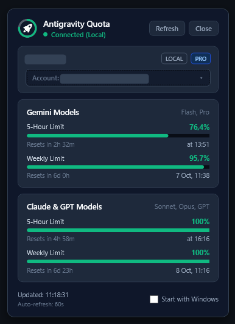

# Antigravity Quota Monitor

A native Windows tray application that tracks your Antigravity AI model quotas in real time. It monitors your 5-hour and weekly usage limits for Gemini, Claude, and GPT models from your system tray, without needing a browser tab open.

Works in two ways:
- **Local Mode**: connects directly to your active Antigravity IDE language server session.
- **Cloud Mode**: connects to the Google Cloud Code API with your Google account, tracking your quotas even when your IDE is closed.

<p align="center">
  
</p>

---

## What It Does

### System Tray Presence
- Sits in the Windows notification area featuring the official Antigravity logo surrounded by a real-time circular progress gauge that dynamically tracks your Gemini 5-hour quota percentage (color-coded: Emerald Green > 50%, Amber 20-50%, Red < 20%).
- Hovering over the icon shows a tooltip with your active source (Local or Cloud) and current quota percentages.
- Right-clicking opens the control menu for quick refreshes, account switching, interval settings, and startup toggles.

### Flyout Dashboard
- Left-click or double-click the tray icon to open the flyout dashboard right above your taskbar.
- Displays model quota cards:
  - **Gemini (Flash & Pro)**: 5-hour rolling pool and weekly pool with visual progress bars and reset countdowns.
  - **Claude & GPT (Sonnet, Opus, GPT)**: 5-hour and weekly quota meters with live reset countdown timers.
- Closes automatically when you click outside or press `Escape`.

### Multi-Account & Source Switching
- Switch between **Local IDE** and any signed-in Google account with one click from the dashboard or tray menu.
- Built-in Google OAuth login: click `+ Add Google Account...` to authenticate in your browser and automatically link your account.
- Shares account tokens with the `antigravity-usage` CLI storage at `%APPDATA%\antigravity-usage\accounts`.
- Automatically refreshes expired OAuth access tokens in the background.

### Native Windows Application
- Built entirely with native C# (WPF and Windows Forms) running on .NET Framework 4.8.
- Starts instantly as a true Windows GUI process (`AG Quota Tracker.exe`), without opening CMD or PowerShell console windows.
- Custom dark slate theme (`#0F172A`) across all cards, buttons, and context menus.

---

## Getting Started

### Running the App
1. Run `AG Quota Tracker.exe`.
2. (Optional) Run `create_shortcut.ps1` in PowerShell to generate shortcuts on your Desktop and Start Menu:
   ```powershell
   powershell -ExecutionPolicy Bypass -File .\create_shortcut.ps1
   ```

When launched, the flyout opens in the lower-right corner of your screen. If the tracker is already running in the background, launching the executable again brings the existing dashboard to the front.

### Switching Accounts
- **From the Dashboard**: Click the account selector button below your profile name, then choose an account from the custom dropdown.
- **From the System Tray**: Right-click the rocket icon, expand **Account / Source**, and choose an account or click `+ Add Google Account...`.

### Tray Menu Actions
- **Open Dashboard**: Opens and focuses the flyout window.
- **Account / Source**: Lists available accounts with active selection indicators.
- **Refresh Usage**: Immediately fetches the latest quota metrics.
- **Auto-Refresh Interval**: Choose between 30 Seconds, 60 Seconds (default), or 5 Minutes.
- **Start with Windows**: Toggles whether the application launches automatically on Windows logon.
- **Exit**: Closes the application completely.

---

## Technical Details

### Architecture & Data Fetching
- **Local Detection**:
  - Scans active processes for Antigravity's `language_server.exe` to find the active port and CSRF token.
  - If no running process is found, starts the headless daemon quietly.
  - Queries Connect-RPC endpoints (`/RetrieveUserQuotaSummary` and `/GetUserStatus`).
- **Cloud Integration**:
  - Connects to `cloudcode-pa.googleapis.com` using OAuth 2.0 bearer tokens.
  - Endpoints: `/v1internal:loadCodeAssist` and `/v1internal:fetchAvailableModels`.
  - Tokens stored securely under `%APPDATA%\antigravity-usage\accounts\<email>\tokens.json`.

### Building from Source
The project requires no external build tools or large SDK installations. You can compile the executable directly using the C# compiler included with Windows:

```powershell
& "C:\Windows\Microsoft.NET\Framework64\v4.0.30319\csc.exe" `
    /target:winexe `
    /out:"AG Quota Tracker.exe" `
    /r:System.dll `
    /r:System.Core.dll `
    /r:System.Drawing.dll `
    /r:System.Windows.Forms.dll `
    /r:System.Web.Extensions.dll `
    /r:System.Management.dll `
    /r:"C:\Windows\Microsoft.NET\Framework64\v4.0.30319\WPF\PresentationCore.dll" `
    /r:"C:\Windows\Microsoft.NET\Framework64\v4.0.30319\WPF\PresentationFramework.dll" `
    /r:"C:\Windows\Microsoft.NET\Framework64\v4.0.30319\WPF\WindowsBase.dll" `
    /r:System.Xaml.dll `
    /win32icon:"assets\icon.ico" `
    "native\Program.cs"
```

---

## Project Structure

```text
ag-tray-monitor/
├── README.md                  # Project documentation
├── AG Quota Tracker.exe       # Compiled standalone native Windows binary
├── create_shortcut.ps1        # Generates Desktop and Start Menu shortcuts
├── native/
│   └── Program.cs             # Native C# WPF source code
└── assets/
    ├── icon.ico               # Windows application icon (pure white glyph)
    ├── icon.png               # High-resolution application logo (pure white glyph)
    └── preview.png            # Application preview screenshot
```
